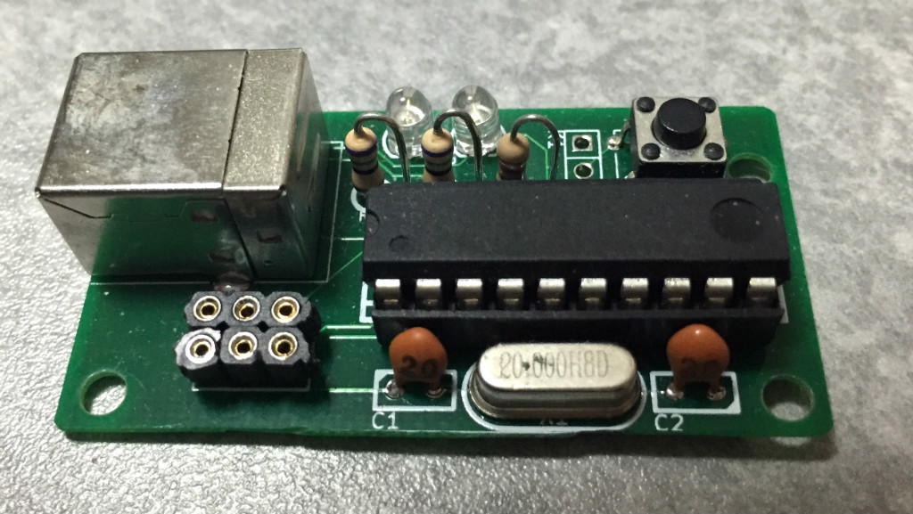

ボタンを押すとユーザ名とパスワードを入力するUSB HIDデバイスです。
AVR(ATTINY2313)を使っていて、USB周りはV-USBです。
入力する内容はEEPROMに記憶させておけます。

会社の社内システムが小賢しいことにブラウザのパスワードマネージャを無効化していて、
ログインするたびに面倒臭いので自動入力デバイスを試作してみました。
そんな小細工するならシングルサインオン実装すればいいのに…

USBデバイスとしてはきっちり認識されているのですが、
なぜかWindows7ではキー入力がOSに認識されないので放置状態です。
Linuxでは問題ないのですが…

- ソース [autokey-hid](https://bitbucket.org/fs495/avr2/src/)
- [回路図](autokey.pdf)
