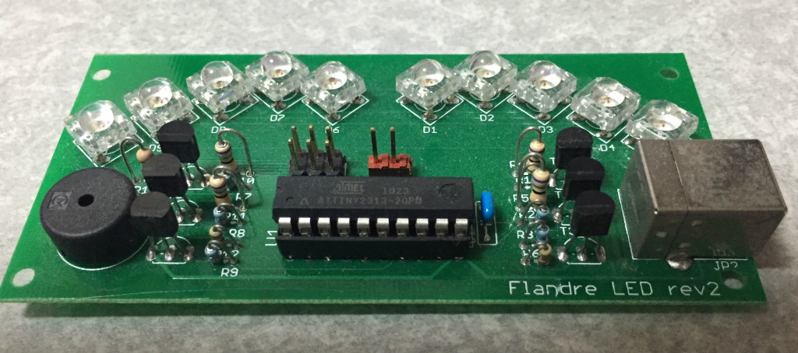

フルカラーLEDをフランちゃんの羽の宝石に見立ててイルミネーションし、
テーマ曲である「U.N.オーエンは彼女なのか？」をビープ音で演奏しつつ点滅させる予定でした。

実際にはテストプログラムを作った時点でプログラムメモリ容量がとても足りないことがわかり、作成は頓挫しています… 495年くらい経ったら動くかｍ(ry
ATtiny2313なので2KBなのですが、これでいけると思ったんだけど甘かった…

フルカラーLEDがマイコン非搭載タイプなので、ダイナミック点灯させるところまでしか手をつけてません。

テーマ曲はMMLで演奏させようと考えていて、曲のMMLファイル、
Rubyでのパーザまでは作りかけました。

- ソース(LED部分) [flan_led1](https://bitbucket.org/fs495/avr2/src/)
- ソース(MML部分) [mml](https://bitbucket.org/fs495/avr2/src/)
- 回路図は捜索中…
