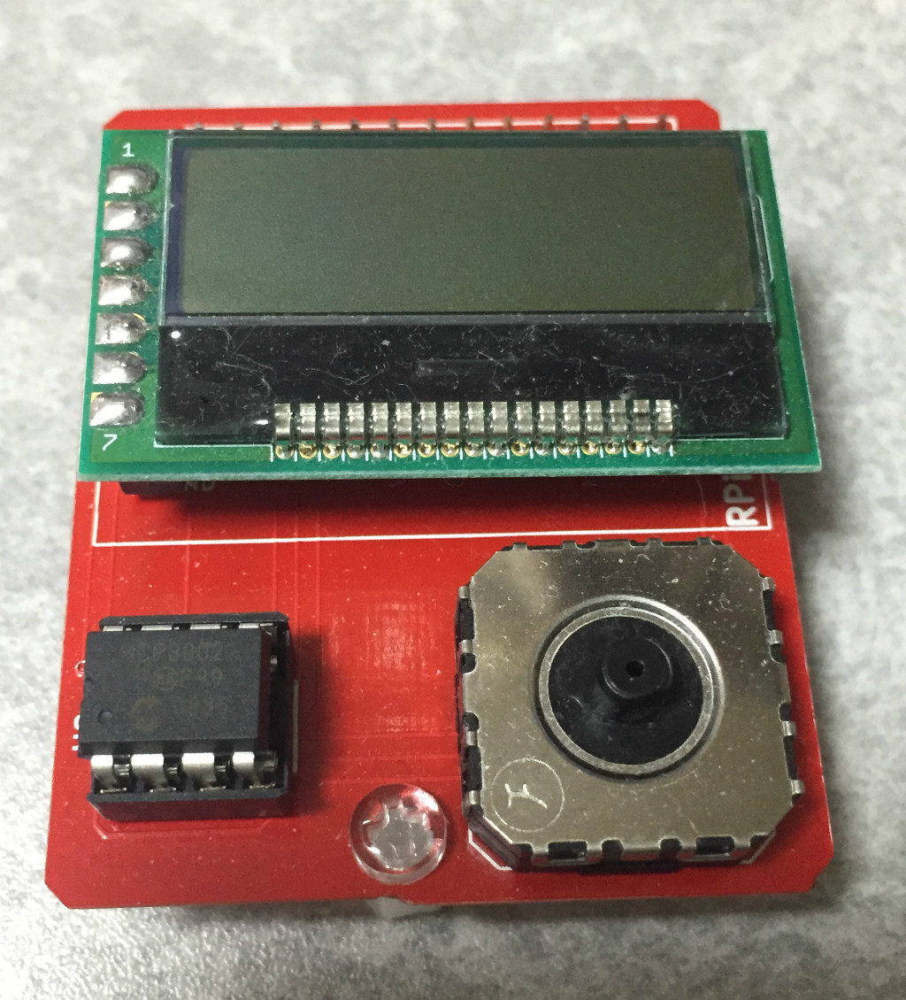

Raspberry Piに接続する、白黒液晶モジュールとアナログジョイスティックの基板です。

白黒液晶モジュールは秋月電子で売ってる[AQM1248A](http://akizukidenshi.com/catalog/g/gP-07005/)用です。
ブレッドボードで動作テストしてるときの様子は[こんな感じ](https://twitter.com/fs495/status/560368754698100738/photo/1)

アナログジョイスティックもやはり[秋月電子で売ってます](http://akizukidenshi.com/catalog/g/gP-04048/)。
どちらかというとスライドパッドみたいな感じで、DualShockなんかを想像してるとちょっと違いますが…
2チャンネル10ビットのA/Dコンバータ経由でRaspberry Piから読み取ってます。
このA/Dコンバータは安くて小さくて結構いいですね。

スタンドアローンでRaspberry Piを操作するときに
表示装置と入力装置必要かなと思ってこんな構成にしてます。

- 液晶モジュール部分 [aqm1248](https://bitbucket.org/fs495/rpi2/src/)
- フォント部分 [aqm1248](https://bitbucket.org/fs495/rpi2/src/)
- A/D部分 [mcp3002_test](https://bitbucket.org/fs495/rpi2/src/)
- SPI部分 [spi](https://bitbucket.org/fs495/rpi2/src/)
- [回路図](js-lcd.pdf)
