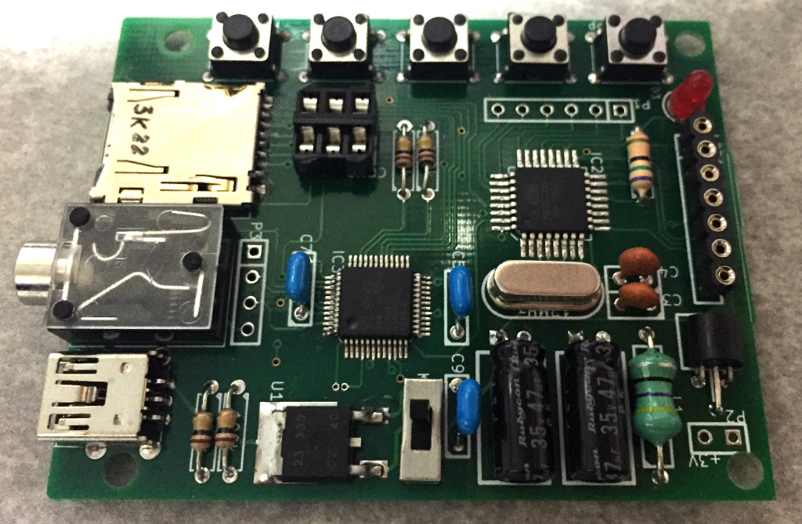

デコーダICを使ったMP3プレイヤー…
なのですが、ファームがまったくできてなくて本当に動くのかどうかも疑わしい状況…ｗ
構成が簡単なので回路だけ先行してしまっています。

まあぶっちゃけ基板のほうがリードタイム長いので、仕事でもハードのほうが先に出来上がってることはよくある(そしてファーム側で細かい尻拭いさせられる)というのはままあることで… すいません、言い訳でしたｗ

ソフト屋だったときは小回りの利かないエレキ屋に不満を持ってましたが、
なんてことはない、自分でやってみれば彼らとまったく同じことをしてましたｗ

CPUとしてAVR(ATmega32)、MP3デコーダとしてVS1011E、メディアとしてマイクロSDカード、表示デバイスとしてモノクロビットマップLCDを準備しています。
各々のデバイスごとに使いこなしを確立していかないといけないので、動作するとしても当分先になりそう…

- [回路図](mp3player.pdf)
