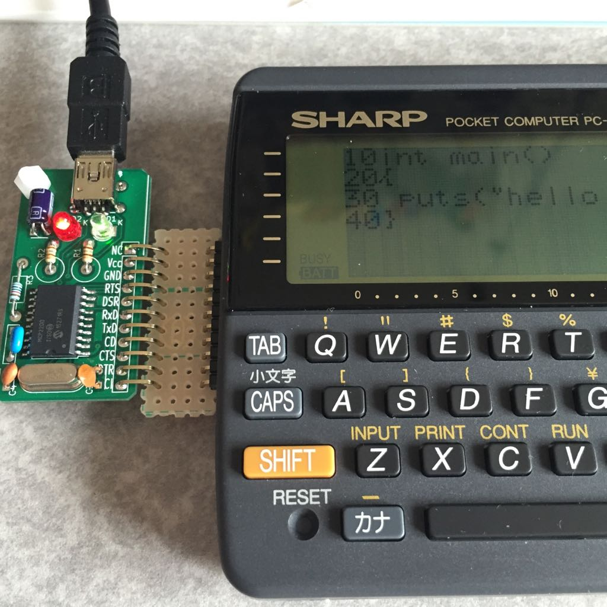

SHARPのポケコンとPCをUSB経由で接続する基板です。
ポケコンからは11ピンの拡張用のソケットが用意されていて、これを使ってPCからポケコン側に電源を供給するとともに、USB-シリアルブリッジを通じてシリアル接続できます…

と言いたいところですが、なんとDCEとDTEを逆に考えてしまうという痛恨のミスがあり、TxDとRxD、RTSとCTSの結線を逆にしてしまいました。
このため、間にあるユニバーサル基板でそれぞれの信号を結線しなおしていますが、本来は必要なかったはずで…

ブレッドボードで実験してた時は、これらの信号を入れ替えないといけないことは分かってたんですけどね…(´Д⊂
一応回路図のっけておきますけど、もしなんか使う機会があったらその点は気をつけてください。
また、MCP2200はシリアル信号の論理を反転させるようなコンフィギュレーションが必要です。

- [回路図](pocketcom-usbserial-if.pdf)
- [KiCADデータ](https://bitbucket.org/fs495/elec4/src/master/pocketcom-usbserial-if/)
