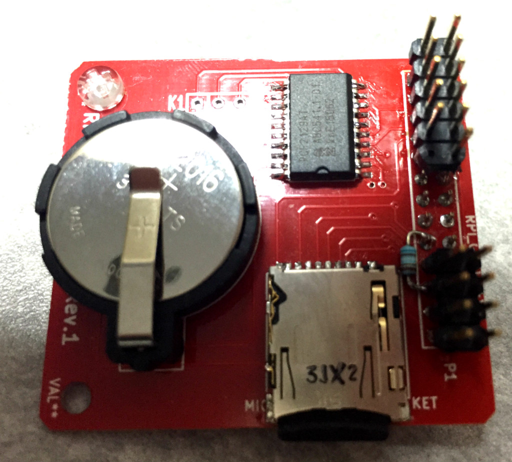

RTC(リアルタイムクロック)とマイクロSDカードスロットを搭載したRaspberry Pi用の基板です。
実時刻でデータを記録していく用途でこういう構成あるかなと思って、こんな組み合わせになってます。
どちらもSPIでRaspberry Piとつながっています。

RTC部分は素直につながっていて、外付け部品もほとんどなくてかなり使いやすいです。
NXPの中の人も[反応してました](https://twitter.com/fs495/status/669231277929705472)。

マイクロSDカード部分のほうが問題で、初期化処理が進まずにまだうまく読み込めてません。
ソケットのハンダ付けでブリッジしてしまったか、
SPIとしてはちょっと特殊なSDカード初期化部分がRaspbian OSのspidevでうまく扱えてないのか…
SPI周りを自分で作りなおさないと切り分けできないので、現在はそこで開発止まってます。

- RTC部分ソース [pcf2129_test](https://bitbucket.org/fs495/rpi2/src)
- [回路図](rtc-sdcard.pdf)
