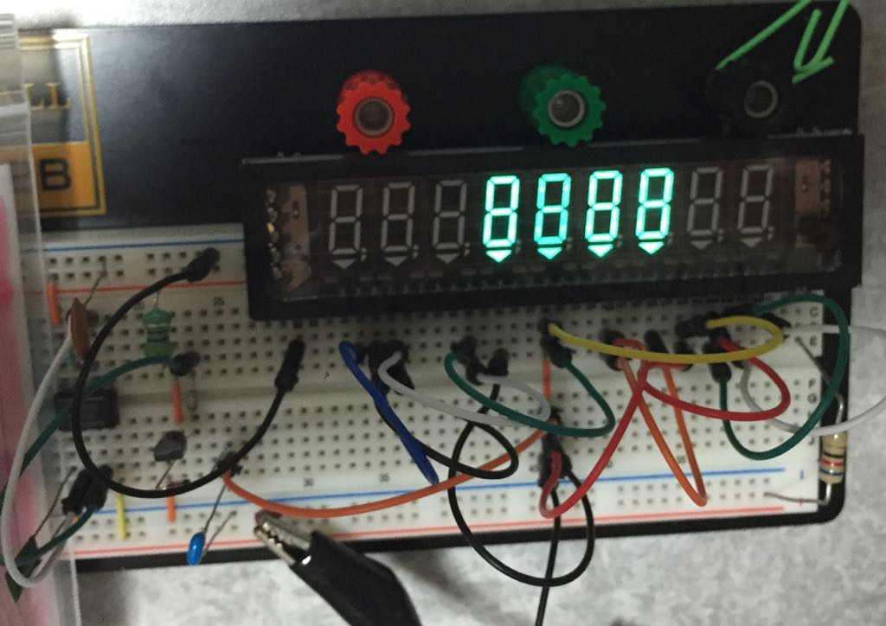

elecrowで蛍光表示管(Vacuum Fluorescent Display; VFD)が[2.80ドルで販売](http://www.elecrow.com/samsung-9bitvfd-module-p-471.html)されてて、興味が出てきたので実験してみました。

蛍光表示管は液晶が普及する前の古い計算機や、今でもオーディオコンポなどでよく使われています。
実家にあった古い計算機がこのタイプで、乾電池2本で動いてたのでたぶん省電力だろうと想像していて、まあ時計でも作ってみたいなあと思ってました。

ただ、調べ始めるといろいろ大変なことがわかってきました…

まず、elecrowのサイトには完成品の写真が転載されているのでいかにも簡単に使えそうですが、実際には高電圧で駆動しないといけないため、マイコン直結というわけにはいきませんでした。
また、原理上、フィラメントにそこそこ大きな電流を流して加熱してやらないといけないため、電力消費もやや多めになるようです。
この電力供給も単純に直流で加えるのでは明るさが左右で差が出てくるとのこと。
また、そもそもデータシートをさがしても見つからず、ピン配置すら分からない始末。
結構クセがある感じですｗ

ただ、真空管の一種であるため半導体にはない面白いところもあって、熱電子放出現象をダイレクトに観察できたり、荷電粒子が電界から力を受けて動くという知識を実際の現象で確認できます。高校物理の実験で取り上げるのもいいんじゃないかな…

7セグLEDの場合はソース側とシンク側のドライブ回路が必要ですが、蛍光表示管の場合はグリッドとアノードを正論理で駆動するだけでいいので、トランジスタアレイを使うと簡単に済みそうです。

ぐぐるとぴったりのドライバICがあるようなのですが、入手性はなんとも言えず…
というか、蛍光表示管モジュールの型番はINRC09SS49T(Samsung製)なのですが、ドライバ回路付きなのかどうかはっきりしない販売サイトばかりで、売る側もあまり分かってないような…

まあそんなこんなで試行錯誤はしましたが、なんとかよさげな表示条件がわかってきたので、参考までに載せておきます。

- [回路図](vfd-test.pdf)
