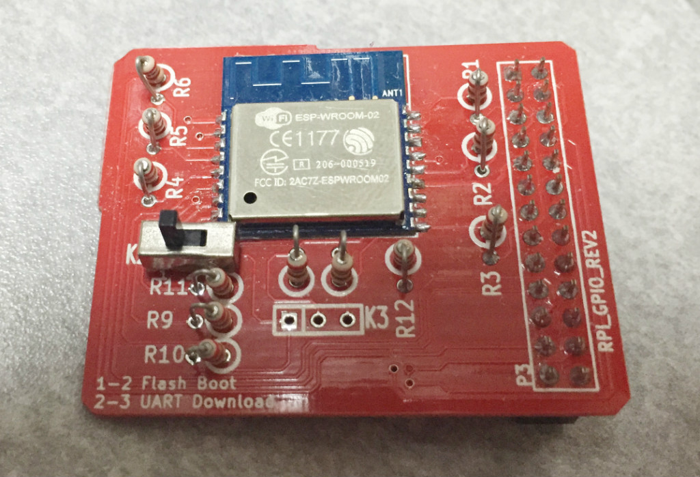

ESP8266を使ったWifiモジュールESP-WROOM-02をRaspberry Piに接続する基板です。

ぐぐるとArduinoにレベル変換して接続する例が多いのですが、
Raspberry PiならUARTで直結できます。

面白いデバイスですが、ぶっちゃけATコマンドよりPPPを実装して欲しかった…ｗ
あと、Raspberryの場合はUSBドングルタイプのWifiモジュールがあるので、
実用にはそっちになっちゃうかなあ…

まあ、Wifiのローレベルな情報がUARTで取れるのはとてもおもしろいですし、
OSの載ってないマイコンあたりでは非常に便利だと思いました。

- Rubyでの操作例 [esp8266](https://bitbucket.org/fs495/rpi2/src/)
- [回路図](rtc-sdcard.pdf)
