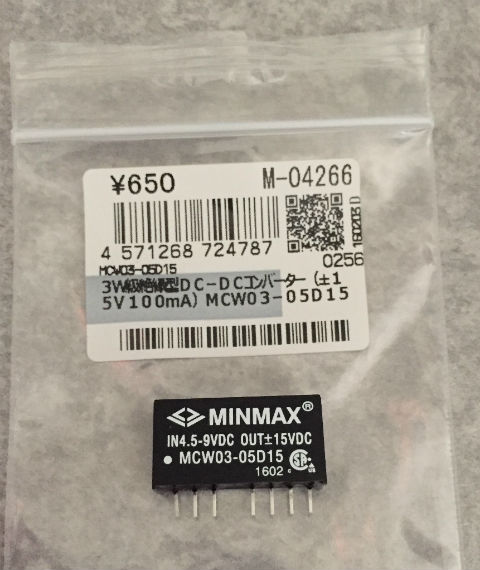
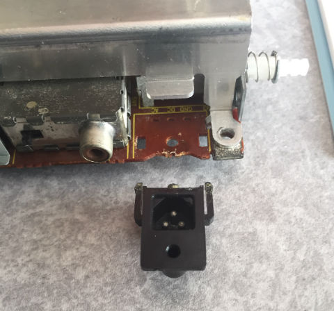
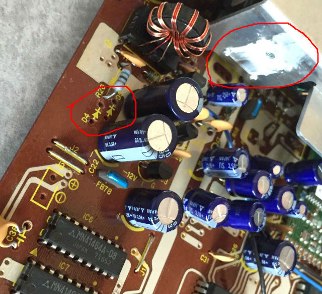
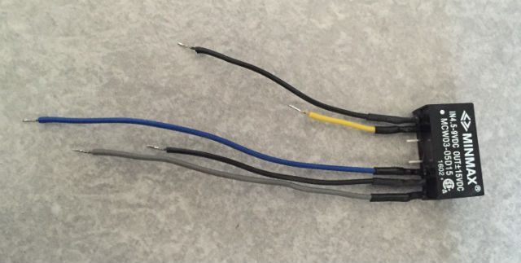
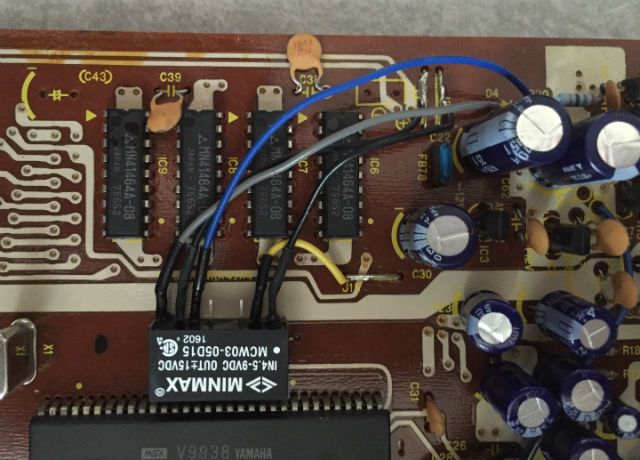
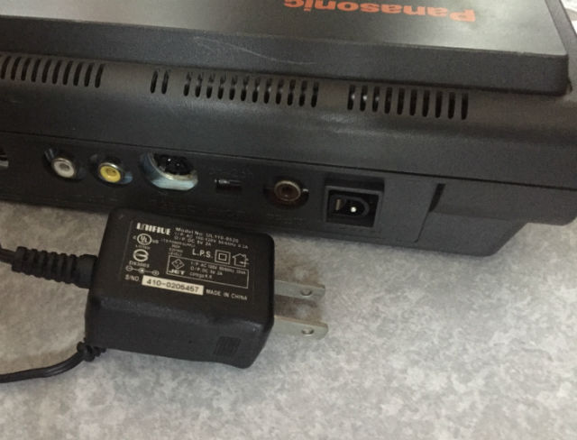

## いきさつ

Panasonic FS-A1シリーズ(無印・mk2)の本体は比較的今でも入手しやすいようですが、一方で電源は外付けのACアダプタ(しかも極めて特殊なタイプ)で、本体との同時入手はかえってかなり難しくなっています。

このACアダプタがどれくらい変態かはこちらのページで…

- [FS-A1mk2の電源入力を単一化する](http://niga2.sytes.net/msx/mk2pw.html)
- [MSX2 FS-A1を代替電源で使う](http://ameblo.jp/hassaku/entry-11567951860.html)

普通のACアダプタだったら、最悪でもコネクタの口径と極性の変更程度で済むんですが…
まあなんとかするしかありませんが、なんとかなりましたので、参考までに紹介します。

## 電源の供給方法

FS-A1のオリジナルのACアダプタ出力はDC9VとAC18Vの構成で、機械内部でDC9Vから+5Vを、またAC18Vからは±12Vを作るようになっています。

この方式を踏襲する手もなくはないのですが、+5Vについては家にDC5V出力のACアダプタが余ってるので、これを直接使うことにしました。これはまああまり問題にはなりません。

問題なのはAC18Vのほうで、トランスがないとACのほうが意外と作りづらい面があります。
そこでAC18Vから±12Vを作る方法はとらず、DC-DCコンバータで5Vから±15Vを作り、それを機械内部のレギュレータ回路を使って±12Vを作ることにしました。
DC-DCコンバータで直接±12Vを作ってもいいのですが、無負荷時に12V以上出す可能性があること、また±12VのDC-DCコンバータより±15Vのものが安かったので、元からあるレギュレータ回路を使うことにしました。DC-DCコンバータは[秋月電子で入手](http://akizukidenshi.com/catalog/g/gM-04266/)しました。

## ACアダプタのジャックを外す

ハンダ吸い取り線を駆使して、もともとあった3ピンのACアダプタのジャックを外します。
5V出力のACアダプタが刺さるジャックを別途用意し、GNDと+5Vを配線します。
+5VはもともとのDC信号に接続し、AC信号には何も接続しません。

## ダイオードとトランジスタの除去

残しておいても害はありませんが、整流用ダイオード(D4,D5)とトランジスタ(Q1)を外しておきます。
トランジスタを外した後、EとCをショートさせておきます。

## ジャンパーへのハンダ付けの準備

基板おもて面にあるジャンパー線にハンダ付けできると便利なので、GND信号であるJ2,J3と、+5V信号であるJ1の被覆をこそげとっておきます。

## DC-DCコンバータにワイヤをハンダ付け

DC-DCコンバータにワイヤをハンダ付けします。
念のため熱収縮チューブで保護しておきます。
3ピン・4ピンは接続しません(写真の上のほうからピンを数える)。

## DC-DCコンバータを配線

以下のように基板にハンダ付けしていきます。

- 1ピン=GND (J2かJ3)
- 2ピン=+5V (J1)
- 5ピン=+15V (D5のカソード側、78L15に接続されている端子)
- 6ピン=GND (J2かJ3)
- 7ピン=-15V (D4のアノード側、79L15に接続されている端子)

DC-DCコンバータは両面テープで基板上に固定しておきます。

## 動作テストとジャックの固定

動作テストし、問題なければACアダプタのジャックを瞬間接着剤で固定します。

もともとあったフェライトビーズや平滑用コンデンサ、電源スイッチはだいたい残したまま単一電源化ができました。
オリジナルのACアダプタは写真でしか見てませんが、これもまたずいぶん小さくなってますね…

ただし、もしやる場合は自己責任になりますので、十分に気をつけてください(お約束)。
