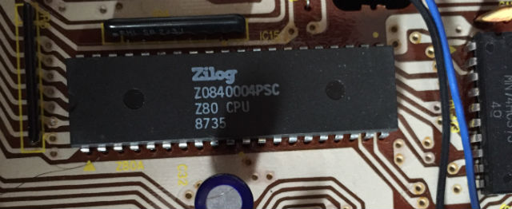
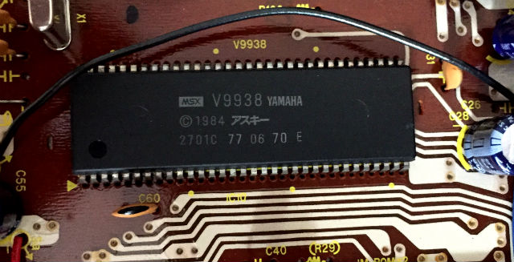
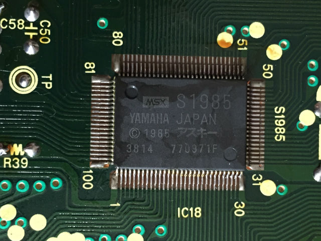

もともとこの機種を持ってたわけではないんですが、なんとなく欲しくなってしまったので、安い中古品を買ってしまいました。
ACアダプタがなかったので[電源を作って](1p.html)います。

まさか21世紀になってZ80のオリジナル品を見ることになるとは…

ピンのピッチが2.54mmなのは時代を感じますね…

MSX2のビデオ周りを担当するVDP、V9938です。
まさか21世紀になってVDPのオリジナル品を(ry

最近ツイッターで知ったのですが、これってヤマハが設計してたんですね。
言われてみれば音源チップの設計はやってたわけなのでそんな不思議ではないのかもですが、それにしてもいろんなことやってる会社ですね。

MSX2のI/Oを詰め込んだMSX-Systemと呼ばれるチップです。
今で言うサウスブリッジというかスーパーIOみたいな位置づけでしょうか。
ここにPSGの機能が入ってるのかな…

補足: MSX-SystemとMSX-Engine間違えて覚えてました。
CPU機能なしのYAMAHA製のものがMSX-System、CPU機能ありの東芝製のものがMSX-Engineですね。
