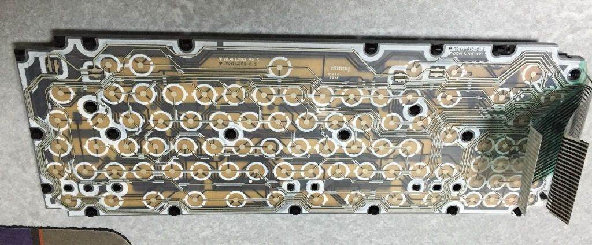
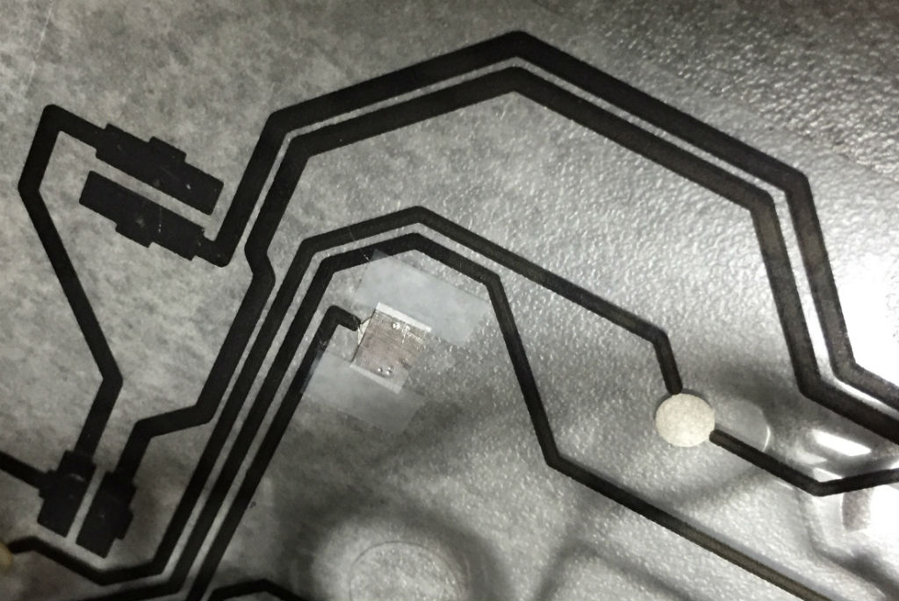

中古のMSX2を入手したのはいいものの、いくつかキーボードのキーの接触が悪いのがわかりました。
MSXはキーボードと本体が一体型の機種がほとんどのため、モダンPCのようにキーボードだけ別のものを使うといったことができません。
このためこれも修復してみることにしました。

これが分解したところで、まあありふれたメンブレン方式のものでした。導電体を塗布した2枚のフィルムで穴の開いた絶縁フィルムを挟み込み、キーを押した時に導電体同士が接触するようになっています。で、この接触がとても悪くなりやすい。

まずはアルコールで接点を拭いてみたものの、まったく状態変わらないので、異物が入ったというわけではないようです。
となると接点自体が逝ってしまったようですが、導電性塗料を塗り直すというのは入手の問題があるので、接点部分にアルミ箔を貼って凌ぐことにしました。

普通の家庭用のアルミ箔をしごいて薄くし、4mm四方に切り取ります。
これが接点部分を覆うようにしてメンディングテープで貼り付けます。
これを接触の悪いキーの両方のフィルムに対して行います。
テープは接点部分にかからなければどこの位置でも構いません
(黒く見えるカーボンの導電性塗料は接点ではないので、この上にテープを貼っても良い)。

こんな感じでキーボード復活しました。
この手はリモコンのキーなんかにも応用が効くみたいですね。
